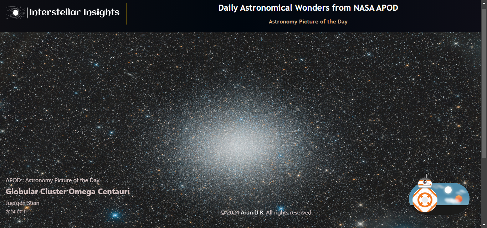

# Interstellar-Insights - Astronomy Picture of the Day (APOD)

Explore the cosmos with NASA's Astronomy Picture of the Day! This React app, built with Vite, fetches and displays the daily astronomical wonders from NASA's APOD API.




## Getting Started

### Prerequisites

- Node.js and npm installed on your machine.

### Installation

1. **Clone the repository:**

    git clone https://github.com/arun-u-r/Interstellar-Insights.git
    cd Interstellar-Insights
    

2. **Install dependencies:**
    
    npm install

3. **Create a `.env` file in the root directory and add your NASA API key:**

    VITE_NASA_API_KEY=your_nasa_api_key_here

4. **Start the development server:**
    
    npm run dev

## Deployment

This project can be deployed to GitHub Pages. Follow these steps:

1. **Install `gh-pages` package:**
    
    npm install --save gh-pages

2. **Add the following scripts to your `package.json`:**

    ```json
    {
      "scripts": {
        "build": "vite build",
        "predeploy": "npm run build",
        "deploy": "gh-pages -d dist"
      }
    }
    ```


